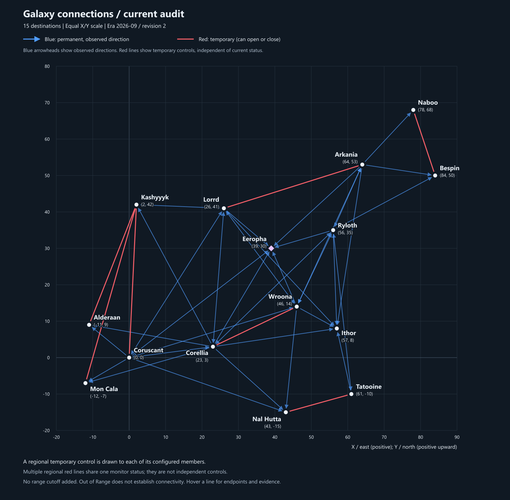

# Galaxy navigation topology map

[SVG](galaxy-hyperlane-map.svg) | [PNG](galaxy-hyperlane-map.png) | [Editable topology](../../data/navigation/galaxy.json)

Blue arrows show directed permanent connections. All temporary connections are solid red without arrowheads; they can randomly open or close. The map represents topology, not live availability. Missing permanent directions are unverified and automatic navigation does not use them.

Era: **2026-09**. Revision: **2**. No ship-range cutoff is applied to this map. Station destinations and refueling details are recorded in the topology artifact.

## Temporary controls

| Monitor endpoints      | Expanded destinations                    |
| ---------------------- | ---------------------------------------- |
| Naboo / Bespin         | Naboo / Bespin                           |
| Corellia / Wroona      | Corellia / Wroona                        |
| Kashyyyk / Core Worlds | Kashyyyk / Coruscant, Alderaan, Mon Cala |
| Arkania / Lorrd        | Arkania / Lorrd                          |
| Hutt Space / Tatooine  | Nal Hutta / Tatooine                     |

Core Worlds expands to its configured members. Regional red segments represent one control, not independent monitor entries. Open-state direct access to each member remains untested.

## Outgoing connections

| Origin    | Observed permanent outgoing connections                                           | Observed temporary outgoing connections |
| --------- | --------------------------------------------------------------------------------- | --------------------------------------- |
| Ithor     | Not yet observed                                                                  | Not yet observed                        |
| Lorrd     | Corellia, Coruscant, Eeropha, Ithor, Kashyyyk, Wroona                             | Not yet observed                        |
| Mon Cala  | Not yet observed                                                                  | Not yet observed                        |
| Nal Hutta | Not yet observed                                                                  | Not yet observed                        |
| Ryloth    | Arkania, Bespin, Corellia, Eeropha, Ithor, Tatooine, Wroona                       | Not yet observed                        |
| Tatooine  | Ithor, Ryloth                                                                     | Not yet observed                        |
| Arkania   | Bespin, Eeropha, Ithor, Naboo, Ryloth, Wroona                                     | Not yet observed                        |
| Bespin    | Not yet observed                                                                  | Not yet observed                        |
| Naboo     | Not yet observed                                                                  | Not yet observed                        |
| Alderaan  | Not yet observed                                                                  | Not yet observed                        |
| Corellia  | Alderaan, Coruscant, Eeropha, Ithor, Kashyyyk, Lorrd, Mon Cala, Nal Hutta, Ryloth | Wroona (T)                              |
| Coruscant | Alderaan, Corellia, Eeropha, Lorrd, Mon Cala, Nal Hutta, Wroona                   | Not yet observed                        |
| Kashyyyk  | Not yet observed                                                                  | Not yet observed                        |
| Wroona    | Arkania, Coruscant, Eeropha, Ithor, Lorrd, Nal Hutta, Ryloth                      | Corellia (T)                            |
| Eeropha   | Not yet observed                                                                  | Not yet observed                        |

Permanent columns come from the authoritative topology; temporary outgoing columns retain available scan evidence and are not live status. Source observations remain in [the flight audit](galaxy-sector-map.md). Update instructions: [CLAUDE.md](../../CLAUDE.md). Regenerate with `pnpm navigation:build`.
