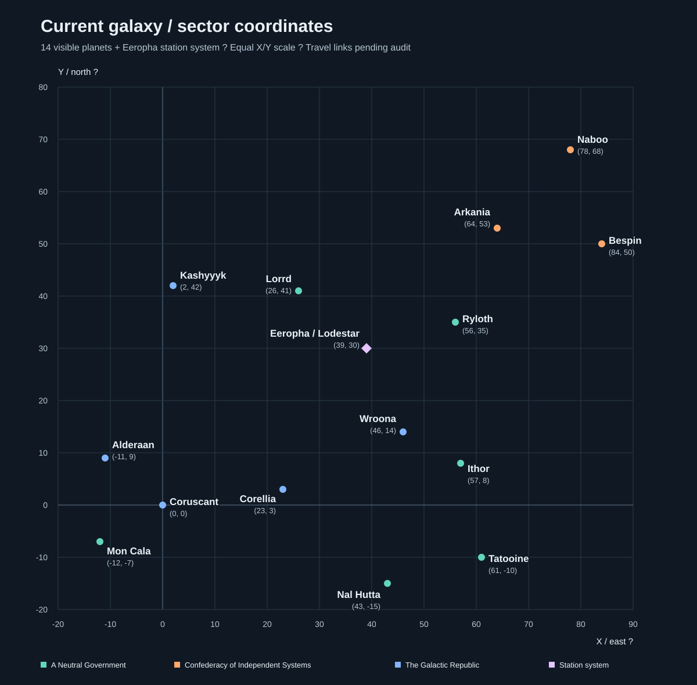
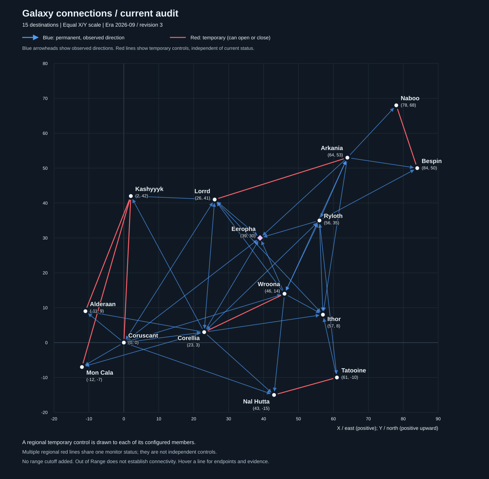

> **Runtime source of truth:** The audited rules now live in [data/navigation/galaxy.json](../../data/navigation/galaxy.json). The planner, Mudlet jump checks and [maintained PNG/SVG map](galaxy-hyperlane-map.md) use this versioned artifact. The tables below preserve the original flight evidence.

# Galaxy sector map and flight observations

This map uses the current roster and X/Y coordinates supplied in this conversation: **14 visible planets and Eeropha System**. Hidden planets are outside this audit. Coordinates describe systems, not landing locations.

[Open the full-size map](galaxy-sector-map.svg). Positive X is right/east; positive Y is up/north. Both axes use the same scale. Colors show the supplied governments; the diamond marks Eeropha, home to Lodestar Utopia Refueling Station. Station government was not supplied.

## Updated connection map

[Open the connection map and edge register](galaxy-hyperlane-map.md). Blue arrows show observed permanent connections. Solid red is reserved for the five monitor controls, which can randomly open or close. Current availability is not encoded in the map. Your latest clarification supersedes the earlier proposed Alderaan / Mon Cala temporary edge.

## Current roster

| Destination        | Starsystem       |   X |   Y | Governed by                        | Notices      |
| ------------------ | ---------------- | --: | --: | ---------------------------------- | ------------ |
| Ithor              | Ottega System    |  57 |   8 | A Neutral Government               | [FP]         |
| Lorrd              | Kanz Sector      |  26 |  41 | A Neutral Government               | [FP]         |
| Mon Cala           | Calamari System  | -12 |  -7 | A Neutral Government               | [FP]         |
| Nal Hutta          | Hutt Space       |  43 | -15 | A Neutral Government               | [FP]         |
| Ryloth             | Gaulus Sector    |  56 |  35 | A Neutral Government               | [FP]         |
| Tatooine           | Arkanis Sector   |  61 | -10 | A Neutral Government               | [FP]         |
| Arkania            | Perave System    |  64 |  53 | Confederacy of Independent Systems | [FP]         |
| Bespin             | Anoat Sector     |  84 |  50 | Confederacy of Independent Systems | []           |
| Naboo              | Chommell Sector  |  78 |  68 | Confederacy of Independent Systems | [FP]         |
| Alderaan           | Alderaan System  | -11 |   9 | The Galactic Republic              | [FP]         |
| Corellia           | Corellian System |  23 |   3 | The Galactic Republic              | [FP]         |
| Coruscant          | Corusca Sector   |   0 |   0 | The Galactic Republic              | [FP]         |
| Kashyyyk           | Mytaranor Sector |   2 |  42 | The Galactic Republic              | [FP]         |
| Wroona             | Wroona System    |  46 |  14 | The Galactic Republic              | [FP]         |
| Eeropha / Lodestar | Eeropha System   |  39 |  30 | Not supplied                       | Not supplied |

Eeropha is a navigation/refueling destination, not an additional planet in the supplied roster. Lodestar?s local space coordinates are **9137, 4521, -18941**; the map uses the system?s sector coordinates **39, 30**.

## Confirmed region membership

**Core Worlds comprises Coruscant (Corusca Sector), Alderaan (Alderaan System), and Mon Cala (Calamari System).** This membership was confirmed by the user after the first two scans.

The previously supplied **Kashyyyk / Core Worlds (T)** monitor entry refers to this region. Membership does not establish which individual direct jumps are available or their current state; those remain part of the flight audit. Core Worlds is not an additional map destination.

## How to read the flight evidence

- **Available:** the readout supplies time and fuel for this direction at the time of the scan. This is not a completed-flight confirmation.
- **No Path:** the game reports a path restriction for this direction at that time; it does not by itself establish a permanent closure.
- **Out of Range:** the ship cannot reach it from this position. Hyperlane connectivity remains unknown; we do not know which restriction the game checks first.
- **Same system:** preserved from the readout, not a self-loop in the future graph.
- Reverse directions need their own observations. No bidirectional edge is inferred from one scan.
- **(T)** identifies one of the five controls in the [latest supplied monitor](galaxy-hyperlane-map.md#exhaustive-temporary-controls). Only these are temporary, per your clarification. Available connections outside that list are classified as permanent; their arrows still reflect only observed directions.

Parsecs, time and fuel below are transcribed as reported, not recomputed from the map. For example, Arkania -> Wroona reports 43.0 while Wroona -> Arkania reports 42.9. Scan timestamps, ship specification and contemporaneous hyperlane states were not supplied.

## From Arkania

| Destination        | Starsystem       | Parsecs | Status       | Time   | Fuel |
| ------------------ | ---------------- | ------: | ------------ | ------ | ---- |
| Kashyyyk           | Mytaranor Sector |    63.0 | No Path      | ->     | ->   |
| Coruscant          | Corusca Sector   |    83.1 | Out of Range | ->     | ->   |
| Alderaan           | Alderaan System  |    87.0 | No Path      | ->     | ->   |
| Corellia           | Corellian System |    64.7 | Out of Range | ->     | ->   |
| Wroona             | Wroona System    |    43.0 | Available    | 5m 10s | 86%  |
| Eeropha / Lodestar | Eeropha System   |    34.0 | Available    | 4m 06s | 68%  |
| Ithor              | Ottega System    |    45.5 | Available    | 5m 28s | 91%  |
| Lorrd              | Kanz Sector      |    39.8 | No Path      | ->     | ->   |
| Nal Hutta          | Hutt Space       |    71.2 | Out of Range | ->     | ->   |
| Tatooine           | Arkanis Sector   |    63.1 | Out of Range | ->     | ->   |
| Mon Cala           | Calamari System  |    96.8 | No Path      | ->     | ->   |
| Ryloth             | Gaulus Sector    |    19.7 | Available    | 2m 26s | 39%  |
| Bespin             | Anoat Sector     |    20.2 | Available    | 2m 30s | 40%  |
| Naboo              | Chommell Sector  |    20.5 | Available    | 2m 32s | 41%  |
| Arkania            | Perave System    |     0.0 | Same system  | 08s    | 0%   |

## From Wroona

| Destination        | Starsystem       | Parsecs | Status       | Time   | Fuel |
| ------------------ | ---------------- | ------: | ------------ | ------ | ---- |
| Kashyyyk           | Mytaranor Sector |    52.2 | Out of Range | ->     | ->   |
| Coruscant          | Corusca Sector   |    48.1 | Available    | 5m 46s | 98%  |
| Alderaan           | Alderaan System  |    57.2 | Out of Range | ->     | ->   |
| Corellia           | Corellian System |    25.5 | Available    | 3m 06s | 52%  |
| Wroona             | Wroona System    |     0.0 | Same system  | 08s    | 0%   |
| Eeropha / Lodestar | Eeropha System   |    17.4 | Available    | 2m 10s | 35%  |
| Ithor              | Ottega System    |    12.5 | Available    | 1m 36s | 25%  |
| Lorrd              | Kanz Sector      |    33.6 | Available    | 4m 04s | 68%  |
| Nal Hutta          | Hutt Space       |    29.2 | Available    | 3m 32s | 59%  |
| Tatooine           | Arkanis Sector   |    28.3 | No Path      | ->     | ->   |
| Mon Cala           | Calamari System  |    61.7 | Out of Range | ->     | ->   |
| Ryloth             | Gaulus Sector    |    23.2 | Available    | 2m 50s | 47%  |
| Bespin             | Anoat Sector     |    52.3 | Out of Range | ->     | ->   |
| Naboo              | Chommell Sector  |    62.7 | No Path      | ->     | ->   |
| Arkania            | Perave System    |    42.9 | Available    | 5m 10s | 87%  |

## From Ryloth

| Destination        | Starsystem       | Parsecs | Status       | Time   | Fuel |
| ------------------ | ---------------- | ------: | ------------ | ------ | ---- |
| Kashyyyk           | Mytaranor Sector |    54.5 | No Path      | -      | -    |
| Coruscant          | Corusca Sector   |    65.9 | Out of Range | -      | -    |
| Alderaan           | Alderaan System  |    71.8 | Out of Range | -      | -    |
| Corellia           | Corellian System |    45.8 | Available    | 5m 30s | 92%  |
| Wroona             | Wroona System    |    23.1 | Available    | 2m 50s | 46%  |
| Eeropha / Lodestar | Eeropha System   |    17.7 | Available    | 2m 12s | 35%  |
| Ithor              | Ottega System    |    26.8 | Available    | 3m 16s | 54%  |
| Lorrd              | Kanz Sector      |    30.6 | No Path      | -      | -    |
| Nal Hutta          | Hutt Space       |    51.5 | Out of Range | -      | -    |
| Tatooine           | Arkanis Sector   |    45.1 | Available    | 5m 24s | 91%  |
| Mon Cala           | Calamari System  |    79.8 | Out of Range | -      | -    |
| Ryloth             | Gaulus Sector    |     0.4 | Same system  | 10s    | 0%   |
| Bespin             | Anoat Sector     |    31.9 | Available    | 3m 52s | 64%  |
| Naboo              | Chommell Sector  |    39.8 | No Path      | -      | -    |
| Arkania            | Perave System    |    19.9 | Available    | 2m 26s | 40%  |

The same-system Gaulus Sector entry is preserved at **0.4 parsecs / 10s**, as reported; it is not a graph edge.

## From Corellia

| Destination        | Starsystem       | Parsecs | Status       | Time   | Fuel |
| ------------------ | ---------------- | ------: | ------------ | ------ | ---- |
| Kashyyyk           | Mytaranor Sector |    44.4 | Available    | 5m 20s | 90%  |
| Coruscant          | Corusca Sector   |    23.2 | Available    | 2m 50s | 47%  |
| Alderaan           | Alderaan System  |    34.6 | Available    | 4m 10s | 70%  |
| Corellia           | Corellian System |     0.2 | Same system  | 08s    | 0%   |
| Wroona             | Wroona System    |    25.5 | Available    | 3m 06s | 52%  |
| Eeropha / Lodestar | Eeropha System   |    31.4 | Available    | 3m 48s | 64%  |
| Ithor              | Ottega System    |    34.3 | Available    | 4m 08s | 70%  |
| Lorrd              | Kanz Sector      |    38.2 | Available    | 4m 36s | 78%  |
| Nal Hutta          | Hutt Space       |    26.8 | Available    | 3m 16s | 54%  |
| Tatooine           | Arkanis Sector   |    40.1 | No Path      | -      | -    |
| Mon Cala           | Calamari System  |    36.4 | Available    | 4m 24s | 74%  |
| Ryloth             | Gaulus Sector    |    46.0 | Available    | 5m 30s | 94%  |
| Bespin             | Anoat Sector     |    77.0 | Out of Range | -      | -    |
| Naboo              | Chommell Sector  |    85.2 | No Path      | -      | -    |
| Arkania            | Perave System    |    64.7 | Out of Range | -      | -    |

The same-system Corellian System entry is preserved at **0.2 parsecs / 08s**, as reported; it is not a graph edge.

## From Coruscant

| Destination        | Starsystem       | Parsecs | Status       | Time   | Fuel |
| ------------------ | ---------------- | ------: | ------------ | ------ | ---- |
| Kashyyyk           | Mytaranor Sector |    42.0 | No Path      | -      | -    |
| Coruscant          | Corusca Sector   |     0.0 | Same system  | 08s    | 0%   |
| Alderaan           | Alderaan System  |    14.2 | Available    | 1m 48s | 28%  |
| Corellia           | Corellian System |    23.2 | Available    | 2m 50s | 46%  |
| Wroona             | Wroona System    |    48.1 | Available    | 5m 46s | 96%  |
| Eeropha / Lodestar | Eeropha System   |    49.2 | Available    | 5m 54s | 99%  |
| Ithor              | Ottega System    |    57.6 | Out of Range | -      | -    |
| Lorrd              | Kanz Sector      |    48.5 | Available    | 5m 48s | 97%  |
| Nal Hutta          | Hutt Space       |    45.5 | Available    | 5m 28s | 91%  |
| Tatooine           | Arkanis Sector   |    61.8 | No Path      | -      | -    |
| Mon Cala           | Calamari System  |    13.9 | Available    | 1m 44s | 27%  |
| Ryloth             | Gaulus Sector    |    66.0 | Out of Range | -      | -    |
| Bespin             | Anoat Sector     |    97.8 | Out of Range | -      | -    |
| Naboo              | Chommell Sector  |   103.5 | No Path      | -      | -    |
| Arkania            | Perave System    |    83.1 | Out of Range | -      | -    |

The same-system Corusca Sector entry is preserved at **0.0 parsecs / 08s**, as reported; it is not a graph edge.

## From Lorrd

| Destination        | Starsystem       | Parsecs | Status       | Time   | Fuel |
| ------------------ | ---------------- | ------: | ------------ | ------ | ---- |
| Kashyyyk           | Mytaranor Sector |    24.0 | Available    | 2m 56s | 48%  |
| Coruscant          | Corusca Sector   |    48.5 | Available    | 5m 48s | 97%  |
| Alderaan           | Alderaan System  |    48.9 | No Path      | -      | -    |
| Corellia           | Corellian System |    38.1 | Available    | 4m 36s | 76%  |
| Wroona             | Wroona System    |    33.6 | Available    | 4m 04s | 67%  |
| Eeropha / Lodestar | Eeropha System   |    17.0 | Available    | 2m 06s | 34%  |
| Ithor              | Ottega System    |    45.3 | Available    | 5m 26s | 91%  |
| Lorrd              | Kanz Sector      |     0.0 | Same system  | 06s    | 0%   |
| Nal Hutta          | Hutt Space       |    58.5 | Out of Range | -      | -    |
| Tatooine           | Arkanis Sector   |    61.9 | No Path      | -      | -    |
| Mon Cala           | Calamari System  |    61.2 | Out of Range | -      | -    |
| Ryloth             | Gaulus Sector    |    30.6 | No Path      | -      | -    |
| Bespin             | Anoat Sector     |    58.7 | No Path      | -      | -    |
| Naboo              | Chommell Sector  |    58.6 | No Path      | -      | -    |
| Arkania            | Perave System    |    39.8 | No Path      | -      | -    |

The same-system Kanz Sector entry is preserved at **0.0 parsecs / 06s**, as reported; it is not a graph edge.

## From Tatooine

| Destination | Starsystem       | Parsecs | Status       | Time   | Fuel |
| ----------- | ---------------- | ------: | ------------ | ------ | ---- |
| Kashyyyk    | Mytaranor Sector |    78.6 | No Path      | -      | -    |
| Coruscant   | Corusca Sector   |    61.8 | No Path      | -      | -    |
| Alderaan    | Alderaan System  |    74.5 | No Path      | -      | -    |
| Corellia    | Corellian System |    40.2 | No Path      | -      | -    |
| Wroona      | Wroona System    |    28.3 | No Path      | -      | -    |
| Eeropha     | Eeropha System   |    45.6 | No Path      | -      | -    |
| Ithor       | Ottega System    |    18.4 | Available    | 2m 16s | 37%  |
| Lorrd       | Kanz Sector      |    61.8 | No Path      | -      | -    |
| Nal Hutta   | Hutt Space       |    18.7 | No Path      | -      | -    |
| Tatooine    | Arkanis Sector   |     0.0 | Same system  | 08s    | 0%   |
| Mon Cala    | Calamari System  |    73.1 | No Path      | -      | -    |
| Ryloth      | Gaulus Sector    |    45.3 | Available    | 5m 26s | 91%  |
| Bespin      | Anoat Sector     |    64.2 | Out of Range | -      | -    |
| Naboo       | Chommell Sector  |    79.8 | No Path      | -      | -    |
| Arkania     | Perave System    |    63.0 | Out of Range | -      | -    |

Tatooine -> Ryloth is now observed available in both directions. Ithor is also available from Tatooine. Nal Hutta reports No Path in this scan, but its temporary control can reopen.

## What these scans change

- **Lorrd -> Kashyyyk, Coruscant, Corellia, Wroona, Eeropha and Ithor are available.** Lorrd/Corellia, Lorrd/Wroona and Lorrd/Coruscant now have available readouts in both directions, observed in separate scans.
- **Lorrd -> Alderaan is No Path at 48.9**, while Coruscant is available at 48.5. Core Worlds membership alone therefore does not imply identical access to every member. Mon Cala reports Out of Range and its connectivity from Lorrd remains unknown.
- Lorrd/Ryloth and Lorrd/Arkania now report No Path in both directions in the supplied scans. Lorrd also reports No Path to Tatooine, Bespin and Naboo, and Out of Range to Nal Hutta. These statuses do not establish permanent closures.

- **Coruscant -> Lorrd is available at 48.5 parsecs**, adding Coruscant to the observed origins that can reach Lorrd beyond its earlier assumed gateways.
- **Coruscant -> Kashyyyk is No Path at 42.0**, while Eeropha is available at 49.2. Coruscant belongs to Core Worlds, but without a contemporaneous hyperlane monitor this does not establish the state or full scope of the Kashyyyk / Core Worlds (T) control.
- Coruscant -> Alderaan and Mon Cala are available. Coruscant/Corellia and Coruscant/Wroona now have available readouts in both directions, observed in separate scans.
- Coruscant -> Tatooine and Naboo report No Path. Ithor, Ryloth, Bespin and Arkania report Out of Range; their connectivity from Coruscant remains unknown.

- **Corellia -> Alderaan (34.6) and Corellia -> Mon Cala (36.4) are available.** The earlier unconditional Coruscant-only access rule is too restrictive. Reverse directions and any temporary controls remain unverified.
- **Corellia -> Lorrd is available at 38.2**, adding another observed exception to the earlier unconditional two-neighbor rule for Lorrd.
- **Corellia -> Tatooine is No Path at 40.1**, despite Corellia -> Ryloth being available at 46.0. Corellia -> Naboo also reports No Path at 85.2; Bespin and Arkania report Out of Range, leaving their connectivity unknown.
- Corellia/Wroona and Corellia/Ryloth now have available readouts in both directions, observed in separate scans. Corellia -> Kashyyyk is also available at 44.4.

- **Ryloth -> Bespin is available at 31.9 parsecs.** This contradicts the earlier unconditional Arkania-only access rule for Bespin. The return direction and any temporary control remain unverified.
- **Ryloth -> Naboo is No Path at 39.8**, while Ryloth -> Tatooine is available at 45.1. Ryloth also reports No Path to Lorrd at 30.6 and Kashyyyk at 54.5.
- Ryloth -> Corellia is available at 45.8, adding another observed connection toward the western systems. Arkania/Ryloth and Wroona/Ryloth now have available readouts in both directions, observed in separate scans.

- **Wroona -> Lorrd is available.** The earlier assumption that only Kashyyyk and Eeropha can reach Lorrd is too restrictive as an unconditional rule. Lorrd's scan now confirms the available return direction to Wroona; any temporary control remains unverified.
- **Wroona -> Tatooine is No Path at 28.3 parsecs**, while Wroona -> Coruscant is available at 48.1. Distance alone cannot explain the restriction.
- **Arkania -> Lorrd is No Path at 39.8**, while Arkania -> Wroona is available at 43.0. This is another clear separation between range and path restrictions.
- Wroona -> Coruscant and Wroona -> Corellia provide observed travel toward the western systems. These seven origin scans do not establish all crossings or a mandatory corridor.
- Out-of-range entries do not confirm or refute gateway assumptions. Ryloth's available Bespin entry does contradict the earlier unconditional Bespin gateway assumption.

## Next observations

Arkania, Wroona, Ryloth, Corellia, Coruscant, Lorrd and Tatooine are recorded. Origins still to survey: **Alderaan, Bespin, Eeropha, Ithor, Kashyyyk, Mon Cala, Naboo and Nal Hutta**. Record the origin and full destination readout, plus the hyperlane monitor state when available.

The [initial connectivity draft](history/hyperlane-connectivity-audit.md) remains available for historical comparison, but its candidate roster and inferred connections are superseded by this evidence wherever they conflict. No planner rules or official topology format have been changed.
