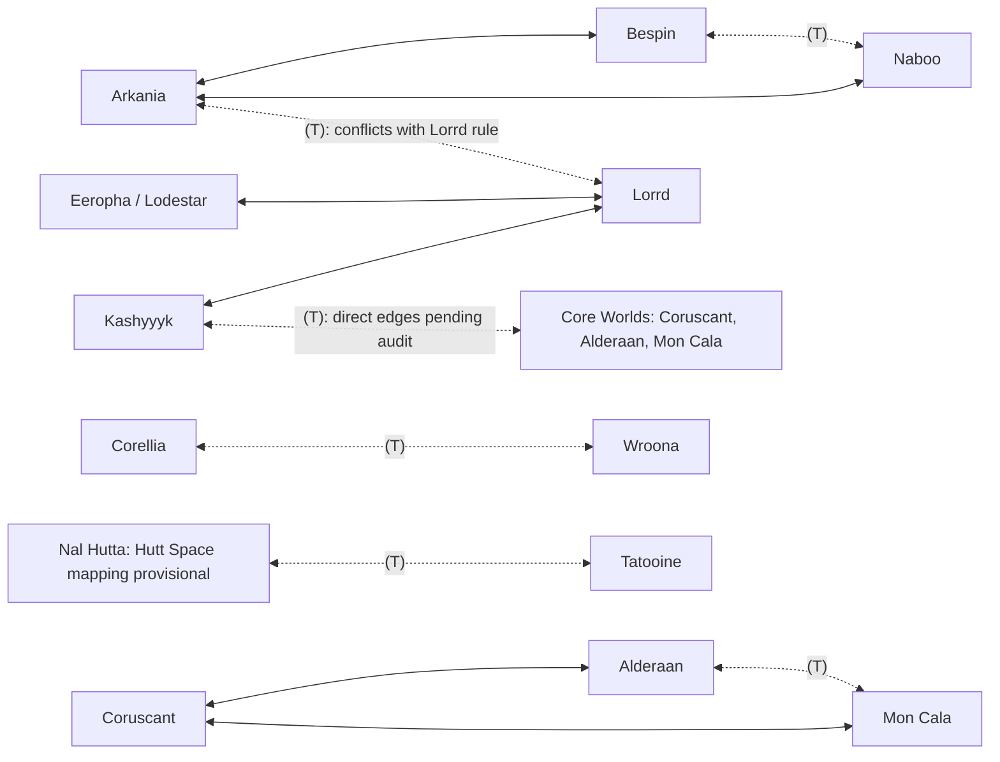

> **Current connection map and definitive temporary list:** See [the updated X/Y map](../galaxy-hyperlane-map.md). Only Naboo/Bespin, Corellia/Wroona, Kashyyyk/Core Worlds, Arkania/Lorrd and Hutt Space/Tatooine are temporary. Corellia/Wroona is Passable; the other four report No Route. The historical Alderaan/Mon Cala (T) assumption below is withdrawn.

> **Lorrd flight evidence:** Lorrd has available readouts to Kashyyyk, Coruscant, Corellia, Wroona, Eeropha and Ithor. Return directions to Coruscant, Corellia and Wroona are now observed as available. See [the Lorrd readout](../galaxy-sector-map.md#from-lorrd); the original two-neighbor assumption below is superseded.

> **Coruscant flight evidence:** Coruscant -> Lorrd is available; Coruscant -> Kashyyyk reports No Path. See [the Coruscant readout](../galaxy-sector-map.md#from-coruscant). These observations do not establish the current state or full scope of the regional hyperlane control.

> **Corellia flight evidence:** Corellia -> Alderaan, Mon Cala and Lorrd are available, contradicting the unconditional gateway assumptions below. See [the Corellia readout](../galaxy-sector-map.md#from-corellia). Reverse directions and temporary controls remain unverified.

> **Additional flight evidence:** Ryloth -> Bespin is available (31.9 parsecs), contradicting the unconditional Arkania-only access assumption below. See [the Ryloth readout](../galaxy-sector-map.md#from-ryloth). Reverse access and temporary controls remain unverified.

> **Superseded working assumptions:** See [the current coordinate map, confirmed visible roster and directional flight observations](../galaxy-sector-map.md). The new Wroona ? Lorrd readout contradicts the unconditional two-neighbor restriction below. This initial draft is preserved for comparison; its inferred edges are not verified game topology.

# Hyperlane connectivity audit — draft for review

**This is a proposed graph for your audit, not official game data or a planner change.** It ignores sector distance, ship range, fuel, cargo, governments and landing-pad permissions. Each edge means a **single direct jump**, not travel through an intermediate planet.

The mechanic is newly introduced, according to your description. This draft uses your corrections and monitor transcript, plus local destination names. No live scan was performed. The old transcript's Passable/No Route values are not treated as current conditions.

## Legend and roster

- **A ↔ B:** bidirectional connection. Both adjacency rows list it.
- **(T):** controlled by the hyperlane mechanic; potentially temporary. This does **not** mean it is open now.
- **Default / non-temporary:** not identified as temporary in the supplied rules. Most such edges are inferred from your “unlisted routes are fair game” rule, not individually flight-tested.
- **[roster?]:** a planet name in the project's visual assets, not confirmed as a current destination by the older planet-command sample or this conversation. Its connections are provisional.
- **Unresolved:** a conflict or endpoint mapping requiring your decision; not silently accepted as an allowed connection.
- **Eeropha:** the navigation/refueling node for **Lodestar Utopia Refueling Station**, not a cargo market.

The working roster contains **21 candidate planets plus Eeropha**: the older AutoPilot sample's 15 planets, Naboo from this conversation, and five additional asset-roster candidates. Please remove obsolete entries or add missing worlds. Asset names do not establish current navigability.

## Rules used for this draft

1. Restrictions apply in both directions.
2. Lorrd has ordinary direct connections only to **Kashyyyk and Eeropha**. The monitored Arkania–Lorrd connection remains an unresolved exception.
3. Bespin and Naboo each connect ordinarily only to **Arkania**, with **Bespin ↔ Naboo (T)** as the conditional shortcut.
4. Alderaan and Mon Cala each connect ordinarily only to **Coruscant**, with **Alderaan ↔ Mon Cala (T)** as the conditional shortcut.
5. Arkania and Coruscant themselves are assumed to retain access to the broader unrestricted network. Please confirm that interpretation of your gateway rules.
6. All other pairs are inferred open by default unless identified as temporary. No connection is removed for distance.
7. **Hutt Space** is provisionally expanded to **Nal Hutta**, using the older planet-command sample. That does not prove Nal Hutta is its only current destination.
8. **Core Worlds = Coruscant, Alderaan, and Mon Cala**, confirmed by the user. The Kashyyyk / Core Worlds (T) monitor entry refers to this region. Individual direct connections and their current availability still need flight observations; membership alone does not confirm them.

## Each destination and its direct connections

The first two connection columns form the provisional adjacency list. The unresolved column is separate. For example, **Lorrd → Ryloth is not a direct edge**, while **Lorrd → Eeropha → Ryloth** is a two-jump path.

| Origin                | Default / non-temporary direct neighbors                                                                                                                                                                                           | Temporary direct neighbors | Unresolved / audit note                                                    |
| --------------------- | ---------------------------------------------------------------------------------------------------------------------------------------------------------------------------------------------------------------------------------- | -------------------------- | -------------------------------------------------------------------------- |
| Alderaan              | Coruscant                                                                                                                                                                                                                          | Mon Cala (T)               | -                                                                          |
| Arkania               | Bespin, Corellia, Coruscant, Dantooine [roster?], Dromund Kaas, Eeropha, Hapes [roster?], Ithor, Kashyyyk, Korriban [roster?], Mandalore [roster?], Mustafar, Naboo, Nal Hutta, Nar Shaddaa [roster?], Ryloth, Tatooine, Wroona    | None                       | Lorrd (T): conflicts with two-neighbor rule                                |
| Bespin                | Arkania                                                                                                                                                                                                                            | Naboo (T)                  | -                                                                          |
| Corellia              | Arkania, Coruscant, Dantooine [roster?], Dromund Kaas, Eeropha, Hapes [roster?], Ithor, Kashyyyk, Korriban [roster?], Mandalore [roster?], Mustafar, Nal Hutta, Nar Shaddaa [roster?], Ryloth, Tatooine                            | Wroona (T)                 | -                                                                          |
| Coruscant             | Alderaan, Arkania, Corellia, Dantooine [roster?], Dromund Kaas, Eeropha, Hapes [roster?], Ithor, Kashyyyk, Korriban [roster?], Mandalore [roster?], Mon Cala, Mustafar, Nal Hutta, Nar Shaddaa [roster?], Ryloth, Tatooine, Wroona | None                       | -                                                                          |
| Dantooine [roster?]   | Arkania, Corellia, Coruscant, Dromund Kaas, Eeropha, Hapes [roster?], Ithor, Kashyyyk, Korriban [roster?], Mandalore [roster?], Mustafar, Nal Hutta, Nar Shaddaa [roster?], Ryloth, Tatooine, Wroona                               | None                       | -                                                                          |
| Dromund Kaas          | Arkania, Corellia, Coruscant, Dantooine [roster?], Eeropha, Hapes [roster?], Ithor, Kashyyyk, Korriban [roster?], Mandalore [roster?], Mustafar, Nal Hutta, Nar Shaddaa [roster?], Ryloth, Tatooine, Wroona                        | None                       | -                                                                          |
| Eeropha               | Arkania, Corellia, Coruscant, Dantooine [roster?], Dromund Kaas, Hapes [roster?], Ithor, Kashyyyk, Korriban [roster?], Lorrd, Mandalore [roster?], Mustafar, Nal Hutta, Nar Shaddaa [roster?], Ryloth, Tatooine, Wroona            | None                       | -                                                                          |
| Hapes [roster?]       | Arkania, Corellia, Coruscant, Dantooine [roster?], Dromund Kaas, Eeropha, Ithor, Kashyyyk, Korriban [roster?], Mandalore [roster?], Mustafar, Nal Hutta, Nar Shaddaa [roster?], Ryloth, Tatooine, Wroona                           | None                       | -                                                                          |
| Ithor                 | Arkania, Corellia, Coruscant, Dantooine [roster?], Dromund Kaas, Eeropha, Hapes [roster?], Kashyyyk, Korriban [roster?], Mandalore [roster?], Mustafar, Nal Hutta, Nar Shaddaa [roster?], Ryloth, Tatooine, Wroona                 | None                       | -                                                                          |
| Kashyyyk              | Arkania, Corellia, Coruscant, Dantooine [roster?], Dromund Kaas, Eeropha, Hapes [roster?], Ithor, Korriban [roster?], Lorrd, Mandalore [roster?], Mustafar, Nal Hutta, Nar Shaddaa [roster?], Ryloth, Tatooine, Wroona             | None                       | Core Worlds (T): Coruscant, Alderaan, Mon Cala; direct edges pending audit |
| Korriban [roster?]    | Arkania, Corellia, Coruscant, Dantooine [roster?], Dromund Kaas, Eeropha, Hapes [roster?], Ithor, Kashyyyk, Mandalore [roster?], Mustafar, Nal Hutta, Nar Shaddaa [roster?], Ryloth, Tatooine, Wroona                              | None                       | -                                                                          |
| Lorrd                 | Eeropha, Kashyyyk                                                                                                                                                                                                                  | None                       | Arkania (T): conflicts with two-neighbor rule                              |
| Mandalore [roster?]   | Arkania, Corellia, Coruscant, Dantooine [roster?], Dromund Kaas, Eeropha, Hapes [roster?], Ithor, Kashyyyk, Korriban [roster?], Mustafar, Nal Hutta, Nar Shaddaa [roster?], Ryloth, Tatooine, Wroona                               | None                       | -                                                                          |
| Mon Cala              | Coruscant                                                                                                                                                                                                                          | Alderaan (T)               | -                                                                          |
| Mustafar              | Arkania, Corellia, Coruscant, Dantooine [roster?], Dromund Kaas, Eeropha, Hapes [roster?], Ithor, Kashyyyk, Korriban [roster?], Mandalore [roster?], Nal Hutta, Nar Shaddaa [roster?], Ryloth, Tatooine, Wroona                    | None                       | -                                                                          |
| Naboo                 | Arkania                                                                                                                                                                                                                            | Bespin (T)                 | -                                                                          |
| Nal Hutta             | Arkania, Corellia, Coruscant, Dantooine [roster?], Dromund Kaas, Eeropha, Hapes [roster?], Ithor, Kashyyyk, Korriban [roster?], Mandalore [roster?], Mustafar, Nar Shaddaa [roster?], Ryloth, Wroona                               | Tatooine (T)               | Hutt Space mapping assumes Nal Hutta; audit membership                     |
| Nar Shaddaa [roster?] | Arkania, Corellia, Coruscant, Dantooine [roster?], Dromund Kaas, Eeropha, Hapes [roster?], Ithor, Kashyyyk, Korriban [roster?], Mandalore [roster?], Mustafar, Nal Hutta, Ryloth, Tatooine, Wroona                                 | None                       | If in Hutt Space, its Tatooine connection may also be (T)                  |
| Ryloth                | Arkania, Corellia, Coruscant, Dantooine [roster?], Dromund Kaas, Eeropha, Hapes [roster?], Ithor, Kashyyyk, Korriban [roster?], Mandalore [roster?], Mustafar, Nal Hutta, Nar Shaddaa [roster?], Tatooine, Wroona                  | None                       | -                                                                          |
| Tatooine              | Arkania, Corellia, Coruscant, Dantooine [roster?], Dromund Kaas, Eeropha, Hapes [roster?], Ithor, Kashyyyk, Korriban [roster?], Mandalore [roster?], Mustafar, Nar Shaddaa [roster?], Ryloth, Wroona                               | Nal Hutta (T)              | Hutt Space mapping assumes Nal Hutta; audit membership                     |
| Wroona                | Arkania, Coruscant, Dantooine [roster?], Dromund Kaas, Eeropha, Hapes [roster?], Ithor, Kashyyyk, Korriban [roster?], Mandalore [roster?], Mustafar, Nal Hutta, Nar Shaddaa [roster?], Ryloth, Tatooine                            | Corellia (T)               | -                                                                          |

## Temporary-edge register

These describe topology controls, not current open/closed status.

| Supplied edge              | Planet-level interpretation                 | Evidence / question                                                                                                                      |
| -------------------------- | ------------------------------------------- | ---------------------------------------------------------------------------------------------------------------------------------------- |
| Naboo ↔ Bespin (T)         | Naboo ↔ Bespin (T)                          | Monitor transcript and your gateway rule.                                                                                                |
| Corellia ↔ Wroona (T)      | Corellia ↔ Wroona (T)                       | Monitor transcript.                                                                                                                      |
| Kashyyyk / Core Worlds (T) | Core Worlds = Coruscant, Alderaan, Mon Cala | Region membership confirmed by the user; individual direct edges and availability remain to be audited.                                  |
| Arkania ↔ Lorrd (T)        | **Conflicting exception**                   | Monitor lists it, but your bidirectional Lorrd rule admits only Kashyyyk and Eeropha. Does an open lane add Arkania as a third neighbor? |
| Hutt Space ↔ Tatooine (T)  | Nal Hutta ↔ Tatooine (T), provisionally     | Older sample places Nal Hutta in Hutt Space. Does this also control Nar Shaddaa or another destination?                                  |
| Alderaan ↔ Mon Cala (T)    | Alderaan ↔ Mon Cala (T)                     | Your description confirms it, but it is absent from the five-row monitor example. What current monitor label controls it?                |

## Visual map of the special connections

This diagram shows gateway restrictions and temporary edges. **It omits the dense default connections among unrestricted nodes; those are expanded in the table above.** It is not a complete edge drawing. Core Worlds is the region containing Coruscant, Alderaan, and Mon Cala, not a separate transit stop. Its regional edge is not yet expanded into verified direct planet-level edges.

## Audit checklist

- [ ] Confirm the planet roster: add missing worlds and remove obsolete or [roster?] entries.
- [ ] Decide whether Arkania ↔ Lorrd becomes usable when its monitored lane is open.
- [x] Define **Core Worlds**: Coruscant, Alderaan, and Mon Cala (user confirmed).
- [ ] Audit which direct connections the Kashyyyk / Core Worlds (T) monitor entry controls.
- [ ] Define current **Hutt Space** membership, including whether Nar Shaddaa belongs in this graph.
- [ ] Confirm the monitor label controlling **Alderaan ↔ Mon Cala (T)**.
- [ ] Confirm Arkania and Coruscant connect to the broader network, rather than only their restricted pairs.
- [ ] Confirm Eeropha connects to the broader network under the default rule, in addition to Lorrd.
- [ ] Check the remaining default connections for additional restrictions or temporary controls.
- [ ] Identify any one-way connections; this draft assumes none.

Annotate rows directly or write corrections such as “remove A ↔ B,” “add A ↔ B (T),” or “Core Worlds = { … }.”

## After your audit

No official data format is introduced yet. After you correct/approve this graph, we can define an editable source of truth for destination IDs and aliases, region/system membership, permanent edges, and conditional edges with their monitor keys. Live availability observations should remain separate from topology. Both the planner and autopilot should consume the approved data instead of separate hardcoded rules.

## Evidence used

- Your monitor transcript and subsequent bidirectional gateway corrections in this conversation.
- `renderer/src/domain/cargoRoutes.ts`: current inferred adjacency rules; evidence of our implementation, not proof of game rules.
- `../AutoPilot/command_outputs.md`: older 15-planet sample and historical system membership. Its coordinates and governments were not used.
- `tests/planet-visuals.test.mjs`: supplementary planet names only.
- `docs/trader/history/where-we-are-at.md`: earlier notes, subordinate to your corrections.
